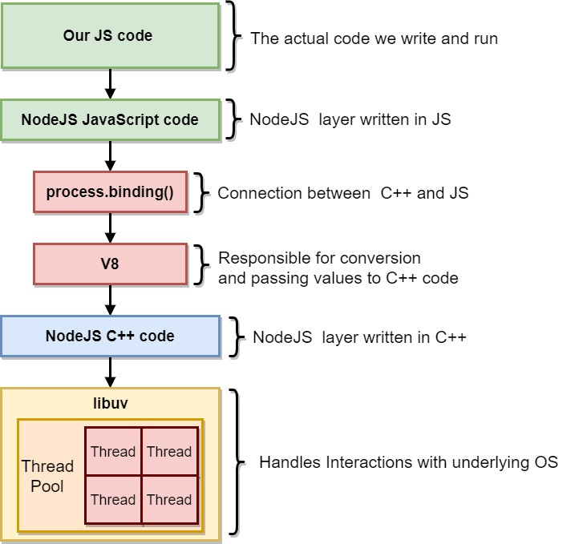
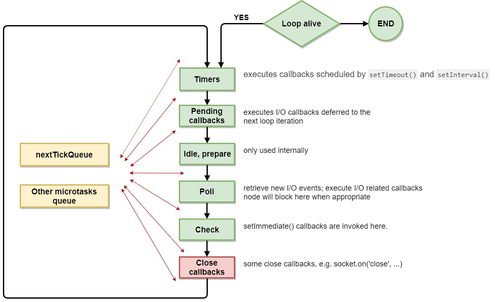

# Node JS components overview
## Node internals

NodeJS is written 50/50 C++ and JS

The actual JS code is interpreted and executed by V8 Engine 

Node bindings connect JS and C++ worlds

libuv C library responsible for underlying OS interaction and some heavy lifting operations. Node can make use of libuv's pre-allocated set of threads valled Thread Pool. 

## Event loop
The event loop is what allows Node.js to perform non-blocking I/O operations — despite the fact that JavaScript is single-threaded — by offloading operations to the system kernel whenever possible.

timers: this phase executes callbacks scheduled by setTimeout() and setInterval()
pending callbacks: executes I/O callbacks deferred to the next loop iteration.
idle, prepare: only used internally.
poll: retrieve new I/O events; execute I/O related callbacks (almost all with the exception of close callbacks, the ones scheduled by timers, and setImmediate()); node will block here when appropriate.
check: setImmediate() callbacks are invoked here.
close callbacks: some close callbacks, e.g. socket.on('close', ...).

## libuv and threadpool

Libuv is an open-source library that handles the thread-pool, doing signaling, inter process communications all other magic needed to make the asynchronous tasks work at all. Libuv was originally developed for Node.js itself as an abstraction around libev, however, by now, multiple projects are already using it.

Most people think libuv is the event loop itself, this is not true, libuv implements a full featured event loop, but also is the home of several other key parts of Node, such as:

TCP and UDP sockets of the net package
Async DNS resolutions
Async file and file system operations (like the one we're doing here)
File System events
IPC
Child processes and shell control
Thread pool
Signal handling
High resolution clock
## Unobvious threadpool behaviour